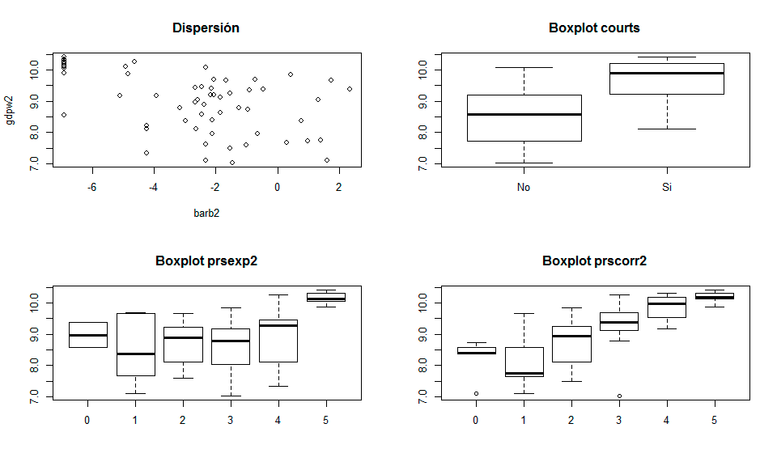
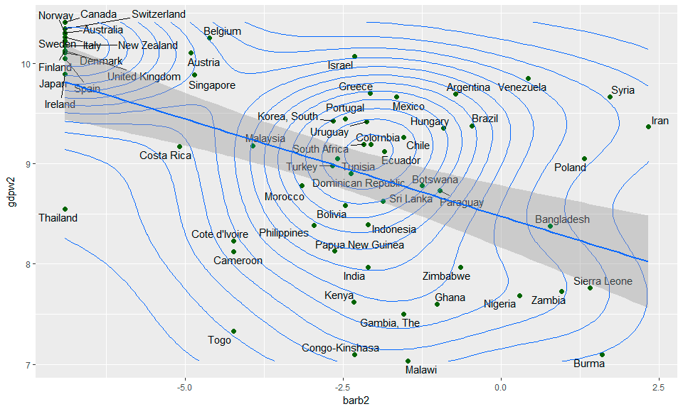

# Ejercicio, análisis de correlación


## Bases de Datos
Para realizar el análisis de correlación vamos a emplear los siguientes ejemplos provenientes de Vincent Arel-Bundock (University of Michigan) e-mail: varel@umich.edu


  
+ Political Economic Risk Data from 62 Countries in 1987:

	+ https://vincentarelbundock.github.io/Rdatasets/csv/Zelig/PErisk.csv

	+ https://vincentarelbundock.github.io/Rdatasets/doc/Zelig/PErisk.html

  
+ Level of Calculus Attained for Students Taking Advanced Micro–economics:

	+ https://vincentarelbundock.github.io/Rdatasets/csv/Ecdat/Mathlevel.csv

	+ https://vincentarelbundock.github.io/Rdatasets/doc/Ecdat/Mathlevel.html


### Importación de datos


Vamos a importar los datos directamente desde internet. Es, quizás, uno de los casos más sencillos pero debe tenerse en cuenta la extensión que se está empleando. Para el ejemplo es CSV  (del inglés comma-separated values), luego trabajaremos en exploración en tablas html y xml.


Llamaremos "datos" a la base con la que trabajaremos, con esto, la sintaxis es:


```{r}

> datos<-read.csv("https://vincentarelbundock.github.io/Rdatasets/csv/Zelig/PErisk.csv")

```


Para consultar la información asociada a la base de datos y las variables se puede acceder a la siguiente dirección:

  + https://vincentarelbundock.github.io/Rdatasets/doc/Zelig/PErisk.html

Ahora grafiquemos el conjunto de datos para observar su comportamiento:

```{r}
> plot(datos)
```


Y miremos la correlación

```{r}
> cor(datos)
Error in cor(datos) : 'x' must be numeric
```

#### Pregunta para los estudiantes: ¿Qué significa ese error que reporta R?

Como se observa, hay un par de variables que no son numéricas. Vamos, entonces, a mirar si esas variables aportan algún tipo de información. Si no, se pueden sacar o emplear de otro modo:

Para ello solicitamos un resumen numérico básico:

```{r}
> summary(datos)
          X            country       courts           barb2           prsexp2         prscorr2         gdpw2       
 Argentina : 1   Argentina : 1   Min.   :0.0000   Min.   :-6.908   Min.   :0.000   Min.   :0.000   Min.   : 7.030  
 Australia : 1   Australia : 1   1st Qu.:0.0000   1st Qu.:-4.895   1st Qu.:3.000   1st Qu.:1.250   1st Qu.: 8.381  
 Austria   : 1   Austria   : 1   Median :0.0000   Median :-2.353   Median :3.000   Median :2.000   Median : 9.185  
 Bangladesh: 1   Bangladesh: 1   Mean   :0.4516   Mean   :-2.926   Mean   :3.274   Mean   :2.532   Mean   : 9.042  
 Belgium   : 1   Belgium   : 1   3rd Qu.:1.0000   3rd Qu.:-1.301   3rd Qu.:4.000   3rd Qu.:4.000   3rd Qu.: 9.889  
 Bolivia   : 1   Bolivia   : 1   Max.   :1.0000   Max.   : 2.337   Max.   :5.000   Max.   :5.000   Max.   :10.410  
 (Other)   :56   (Other)   :56 
```

Vemos que "X" y "country" son la misma variable; además, "country" es un factor que no se repite. Por lo tanto, podemos excluirlas y emplearlas para identificar las observaciones:

```{r}
> datos1<-datos[,-1] # quitamos "X" que es la 1ra Columna de la matriz
>                    # Recordemos que el ordenamiento es matricial, entonces
>                    # las cifras dentro del corchete se leen: [fila,columna]
```

Ahora, usemos "country" para identificar las observaciones y, a la ves la eliminamos de la base como variable:

```{r}
> row.names(datos1)<-datos1[,1]; datos1<-datos1[,-1]
```

Visualicemos el encabezado de los datos

```{r}
> head(datos1)
           courts      barb2 prsexp2 prscorr2     gdpw2
Argentina       0 -0.7207754       1        3  9.690170
Australia       1 -6.9077550       5        4 10.304840
Austria         1 -4.9103370       5        4 10.100940
Bangladesh      0  0.7759748       1        0  8.379768
Belgium         1 -4.6173440       5        4 10.250120
Bolivia         0 -2.4614400       0        0  8.583543
```

#### Pregunta para los estudiantes: ¿De las variables observadas, cuáles son Factores y cuáles Covariables?

Convirtamos en factores las variables que lo son:

```{r}
> datos1$courts<-factor(datos1$courts,labels=c("No","Si"))
> head(datos1)
           courts      barb2 prsexp2 prscorr2     gdpw2
Argentina      No -0.7207754       1        3  9.690170
Australia      Si -6.9077550       5        4 10.304840
Austria        Si -4.9103370       5        4 10.100940
Bangladesh     No  0.7759748       1        0  8.379768
Belgium        Si -4.6173440       5        4 10.250120
Bolivia        No -2.4614400       0        0  8.583543
> datos1$prsexp2<-factor(datos1$prsexp2)
> datos1$prscorr2<-factor(datos1$prscorr2)
```

Pidamos, nuevamente, un resumen numérico:

```{r}
> summary(datos1)
 courts      barb2        prsexp2 prscorr2     gdpw2       
 No:34   Min.   :-6.908   0: 2    0: 5     Min.   : 7.030  
 Si:28   1st Qu.:-4.895   1: 6    1:11     1st Qu.: 8.381  
         Median :-2.353   2: 7    2:18     Median : 9.185  
         Mean   :-2.926   3:19    3:11     Mean   : 9.042  
         3rd Qu.:-1.301   4:14    4: 8     3rd Qu.: 9.889  
         Max.   : 2.337   5:14    5: 9     Max.   :10.410
```

#### Pregunta para los estudiantes: ¿Cuáles variables graficamos mediante una diagrama de dispersion y cuáles mediante cajas?

```{r}
> par(mfrow=c(2,2))
> with(datos1,plot(barb2,gdpw2,main="Dispersión"))
> with(datos1,plot(courts,gdpw2,main="Boxplot courts"))
> with(datos1,plot(prsexp2,gdpw2,main="Boxplot prsexp2"))
> with(datos1,plot(prscorr2,gdpw2,main="Boxplot prscorr2"))
```


### Vamos, ahora, a hacer gráficas más bonitas. Primero, instalemos librerías

```{r}
> library(ggplot2) # Si no está instalado: install.packages("ggplot2")
> library(reshape2) # Si no está instalado: install.packages("reshape2")
> library(GGally) # Si no está instalado: install.packages("GGally")
> library(ggrepel) # Si no está instalado: install.packages("ggrepel")
```

Ahora, hagamos un Gráfico de Dispersión:

```{r}
> ggplot(datos1, aes(x=barb2, y=gdpw2)) +  geom_point(size=2,col="darkgreen")+ 
+   geom_text_repel(label=rownames(datos1))+  geom_density_2d()+
+   geom_smooth(method=lm)
```



#### Pregunta para los estudiantes: ¿Qué interpretación podemos darle a este gráfico?

Boxplot:

```{r}
ggplot(datos1,aes(y = gdpw2, x = courts))  +
geom_boxplot()+ labs(x="Courts",y="GDP")+
  stat_summary(fun.y=mean, colour="red", geom="point", 
               shape=20, size=3) 
```

Otros factores

```{r}
ggplot(datos1,aes(y = gdpw2, x = prsexp2))  +
geom_boxplot()+ labs(x="Courts",y="GDP")+
  stat_summary(fun.y=mean, colour="red", geom="point", 
               shape=20, size=3) 

ggplot(datos1,aes(y = gdpw2, x = prscorr2))  +
geom_boxplot()+ labs(x="Courts",y="GDP")+
  stat_summary(fun.y=mean, colour="red", geom="point", 
               shape=20, size=3) 
```

## Correlación

Gráficamente:

```{r}
ggcorr(datos[,-c(1:2)], palette = "RdBu", label = TRUE)
```

Y el Coef. Correlación
```{r}
cor(datos1)
```

#### Pregunta para los estudiantes: ¿Por qué se presenta este error?

Entonces, empleemos la otra base de datos donde están los valores numéricos, suprimiendo las dos variables de factor:

```{r}
cor(datos[,-c(1:2)])
```

#### Pregunta para los estudiantes: ¿Cómo interpretamos eso valores?


Veamos la correlación parcial:

```{r}
library(ppcor) # Si no está instalada se usa: install.packages("ppcor")
pcor(datos[,-c(1:2)])
```

#### Pregunta para los estudiantes: ¿Cómo interpretamos eso valores?

Veamos ahora la correlación múltiple:

```{r}
# Necesitamos crear la función:

#coeficiente
# Función para calcular el Coeficiente de correlacion multiple.
rho.mult<-function(datos)
  # datos: matriz con las variables del problema.
  # La primera columna debe ser la variable respuesta.
  # Las restantes p-1 columnas son las variables explicativas.
{
  matriz<-var(datos)
  # calculo
  n<-nrow(datos)
  p<-ncol(matriz)
  sxx<-matriz[2:p,2:p]
  syx<-matrix(matriz[1,2:p],nrow=1)
  sxy<-t(syx)
  #coeficiente
  rho.mult<-sqrt(syx%*%solve(sxx)%*%sxy)/sqrt(matriz[1,1])
  cat("\n Coeficiente de correlación multile: ",rho.mult,"\n")
  #estadistico
  if(abs(rho.mult)==1)
    stop("Imposible resolver contraste.
         Coeficiente de correlación múltiple igual a 1", call. = FALSE)
  else{
    est<-((n-(p-1)-1)*rho.mult)/((p-1)*(1-rho.mult^2))
    #grafico
    par(mfrow=c(1,1))
    x<-seq(0,qf(0.999,p-1,n-(p-1)-1),length=500)
    plot(x,df(x,p-1,n-(p-1)-1),type="l",ylab="densidad",
         main="Contraste Correlación Múltiple")
    abline(v=qf(0.975,p-1,n-(p-1)-1),col="red")
    abline(v=qf(0.025,p-1,n-(p-1)-1),col="red")
    abline(v=est,col="blue")
    abline(h=0)
    legend(qf(0.98,p-1,n-(p-1)-1),pf((p+3)/(n-p),p-1,n-(p-1)-1),
           c("Estadístico","Región Crítica"),lty=rep(1,2),
           col=c("blue","red"),bty="n")
    cat("\n Estadístico de contraste: ",round(est,3),"\n")
    cat("\n p-valor: ",round(2*(1-pf(est,p-1,n-(p-1)-1)),3),"\n\n")}
  return(invisible())
}
```

Ahora, sí lo podemos calcular:

```{r}
rho.mult(datos[,-c(1:2)])
```

#### Pregunta para los estudiantes: ¿Por qué ése resultado? ¿Qué significa?

## Corresponde al estudiante realizar el ejercicio con la otra base de datos
